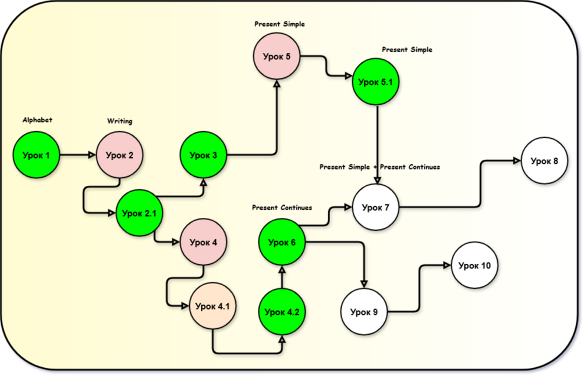

# Формирование персональной траектории обучения

## Описание проекта

Онлайн-платформа для репетиторов начальной и средней школы, позволяющая управлять учениками двумя способами: вручную добавлять и редактировать профиль ученика (ФИО, контактные данные, интересы, особенности, пробелы в знаниях) или запускать поиск в публичных источниках по интересам для автоматизирования процесса составления заданий. В процессе составления заданий собранные данные объединяются и нормализуются, после чего LLM используется для генерации учебных задач, предложений по персонализации уроков, идей для упражнений и планов занятий. Платформа помогает репетиторам быстрее и точнее готовиться к занятиям, учитывая личные интересы, образовательные потребности и навыки каждого ученика.

## Цель проекта

Повысить качество и эффективность подготовки репетиторов к занятиям через автоматический сбор данных об интересах учеников и использование AI для персонализации учебного материала, что сокращает время подготовки и улучшает образовательные результаты учащихся.

## Функциональность

1. Возможность внести и отредактировать информацию об ученике в его профиле на сайте;
2. Автоматический сбор данных об интересах учеников из множества источников;
3. Генерация тем и вопросов для занятия по определённому школьному предмету: подбор упражнений и вопросов, адаптированных под интересы и уровень ученика;
4. Возможность составлять отчёты по прогрессу ученика;
5. Возможность корректировать учебный план на основе успехов или ошибок ученика, возникших в ходе изучения предыдущих тем.

# Product Requirements Document (D1)

## 1. Какую проблему мы решаем?

Наш проект предоставляет репетиторам уникальную возможность улучшить процесс обучения и упростить процесс подготовки к занятиям, позволяя системе, используя внесённые в систему данные об учениках и их интересах, автоматически генерировать задания на определённую тематику.

В профиле ученика можно отображать его прогресс в виде отчётной информации, включая графики и иные способы отображения данных. Это решает проблемы коммуникации с родителями, если у репетитора много учеников или нужно быстро сообщить или показать, что ученик успешно осваивает новые темы.

Система помогает, если ученик не освоил тему по плану. Каждое задание адаптируется в зависимости от ошибок или успехов ученика на пройденном пути. Это позволяет повторять пройденные темы. В результате каждая тема изучается на высоком уровне.

Таким образом, наш проект не только экономит время репетиторов, но и значительно повышает мотивацию, внимание и уровень знаний учащихся благодаря персонализированным урокам.

---

## 2. Сегменты пользователей

### Репетиторы

После пандемии многие семьи и школы переосмыслили подход к обучению: загруженность родителей и учащихся сделала гибкость и экономию времени при подготовке к занятиям особенно важной. Большинство репетиторов младших и средних классов ведут плотный график, часто совмещая преподавание с учёбой в вузе или другой работой. Ученики в этом возрасте нередко теряют мотивацию в связи невозможностью репетитора уделить достаточно внимания и времени на подготовку персонализированных уроков, которые могли бы заинтересовать ребёнка, учесть его особенности и уровень знаний.

---

## 3. Pain Points

### Ученик не заинтересован

Многие преподаватели иногда сталкиваются с проблемой отсутствия интереса у учеников. Дети просто отказываются воспринимать информацию, а родители винят в этом репетитора.

Как решается сейчас:

1. Беседа с учеником;
2. Создание более интересных, персонализированных занятий;
3. Внедрение более коротких занятий;
4. Занятия в виде игры;
5. Поощрение учащегося в виде награды за занятия;
6. Беседа с родителями ученика.

### Нехватка времени на подготовку к занятию

Преподаватели, совмещающие работу с учёбой или же набирающие большое количество учеников, иногда испытывают нехватку времени на подготовку к занятию, из-за чего уроки становятся менее качественными и бездушными.

Как решается сейчас:

1. Создание шаблонного плана проведения занятия;
2. Копирование готовых заданий;
3. Делегирование части подготовки на родителей/ученика;
4. Приложения для генерации заданий (https://thenewschool.ru/generator-testov);
5. Укорачивание занятий.

### Отсутствие индивидуального подхода к ученикам

Стандартные материалы и методы обучения не учитывают индивидуальные особенности учеников: их интересы, сильные и слабые стороны, мотивацию и скорость усвоения. Это снижает эффективность занятий и замедляет прогресс.

Как решается сейчас:

1. Уникальные вопросы или тесты для ученика;
2. Обратная связь родителей.

### При большом количестве учеников тяжело запоминать какие темы у кого на каком уровне

Преподавателю, работающему с большим количеством учеников, сложно запомнить, кто что уже прошел, где у кого пробелы и какие методы лучше использовать для объяснения новых понятий. Это снижает качество преподавания и мешает индивидуальному подходу.

Как решается сейчас:

1. Ведение бумажных/электронных заметок по каждому ученику;
2. Регулярные повторения на занятиях;
3. Отмечать прогресс у самих учеников (наклейки в дневнике).

---

## 4. Анализ текущих решений

### Ученик не заинтересован

1. Беседа с учеником

- Плюсы:
  - Ученик начнёт доверять преподавателю больше и улучшится коммуникация;
  - Можно совместно с учеником придумать мотивацию;
  - Если ученик будет открыт, выяснится любая причина незаинтересованности.
- Минусы:
  - Ученик может бояться открыться преподавателю и ничего не расскажет;
  - Необходимо выделить на этот разговор время и силы;
  - Сам ученик может не понимать почему ему не интересно: "просто плохой предмет и всё".

2. Создание более интересных, персонализированных занятий

- Плюсы:
  - Повышается вовлечённость ученика за счёт учёта интересов;
  - Ученику может быть проще понять материал на знакомом примере;
  - Ученик видит сколько усилий уходит на занятия и чувствует ответственность.
- Минусы:
  - Подготовка занимает больше времени;
  - Требуется узнать интересы ученика и проявить креативность;
  - Индивидуализация занятий не всегда решает незаинтересованность.

3. Внедрение более коротких занятий

- Плюсы:
  - Короткие занятия проще продумать, освобождается время и силы и у преподавателя, и у ученика;
  - Проще найти время в расписании для короткого занятия;
  - У детей с малым объемом внимания его хватит на всё занятие.
- Минусы:
  - Тяжело уместить разбор сложной темы в короткое занятие;
  - Может понадобиться скомпенсировать длину занятий количеством занятий, что может быть неудобным (если нужно куда-то ездить).

4. Занятия в виде игры

- Плюсы:
  - Интерактивные занятия лучше запоминаются;
  - Навыки применяются на практике.
- Минусы:
  - Не любую тему можно превратить в игру;
  - Игра может утратить образовательную нагрузку;
  - Требует значительной подготовки.

5. Поощрение учащегося в виде награды за занятия

- Плюсы:
  - Быстрая внешняя мотивация;
  - Можно довольно детально выбирать что именно поощрается.
- Минусы:
  - Придётся выделять средства;
  - Ученик может потерять оставшуюся мотивацию делать что-то без наград.

6. Беседа с родителями ученика

- Плюсы:
  - Родители могут объяснить домашнюю обстановку;
  - Совместные шаги к обучению и дома, и на занятиях с репетитором усилят эффект обучения;
  - Можно договориться о домашних поощрениях.
- Минусы:
  - Ученик может потерять доверие к преподавателю;
  - Родители могут посчитать преподавателя некомпетентным;
  - Родители могут быть заняты, невовлечены или неправильно отреагировать.

**Чем наш проект поможет:** если ученик активно пользуется интернетом, через наш сервис легко выяснить его интересы. Это помогает лучше понять, как мотивировать его. Мы также можем составить задания или выбрать тему следующего занятия, учитывая его интересы и уровень подготовки. Всё это можно сделать на одной веб-странице, которая интуитивно понятна и не требует много времени на освоение.

### Нехватка времени на подготовку к занятию

1. Создание шаблонного плана проведения занятия

- Плюсы:
  - Быстрое создание новых занятий;
  - Занятия будут структурированные, однообразные.
- Минусы:
  - Из-за однообразия ученик может потерять интерес;
  - Требуется много времени на качественный шаблон.

2. Копирование готовых заданий

- Плюсы:
  - Моментальная экономия времени;
  - Зачастую такие задания уже проверены на ошибки и оценены по сложности.
- Минусы:
  - Возможное несоответствие интересам и уровню ученика;
  - Меньше контроля над качеством и последовательностью занятий;
  - Легко найти ответы к таким заданиям.

3. Делегирование части подготовки на родителей/ученика

- Плюсы:
  - Снижает нагрузку на репетитора;
  - Повышает ответственность ученика, вовлекая семью.
- Минусы:
  - Родители не всегда готовы помочь;
  - Ученик не всегда достаточно ответственный;
  - Нужна чёткая инструкция и контроль выполнения, иначе качество подготовки упадёт.

4. Приложения для генерации заданий (https://thenewschool.ru/generator-testov)

- Плюсы:
  - Быстрая генерация заданий;
  - Можно сразу распечатать.
- Минусы:
  - Сгенерированные задания могут содержать ошибки;
  - Не учитываются индивидуальные особенности ученика;
  - Качество, стиль, возможности зависят от сервиса генерации.

5. Укорачивание занятий

- Плюсы:
  - Короткие занятия проще продумать, освобождается время и силы и у преподавателя, и у ученика;
  - Проще найти время в расписании для короткого занятия;
  - У детей с малым объемом внимания его хватит на всё занятие.
- Минусы:
  - Тяжело уместить разбор сложной темы в короткое занятие;
  - Может понадобиться скомпенсировать длину занятий количеством занятий, что может быть неудобным (если нужно куда-то ездить).

**Чем наш проект поможет:** через наш сервис удобно быстро генерировать задания или идеи для заданий, учитывая при этом записанные индивидуальные особенности учеников.

### Отсутствие индивидуального подхода к ученикам

1. Уникальные вопросы или тесты для ученика

- Плюсы:
  - Быстрая диагностика интересов/уровня знаний ученика;
  - Дают количественный результат.
- Минусы:
  - Такие тесты, не обязательно выглядящие как что-то образовательное, могут путать или пугать младших учеников;
  - Результаты требуют интерпретации.

2. Обратная связь родителей

- Плюсы:
  - Даёт информацию о домашней среде, привычках и внешних факторах, влияющих на учёбу;
  - Помогает согласовать цели и методы, повысить поддержку вне занятий;
  - Родители могут предложить ресурсы и идеи для персонализации.
- Минусы:
  - Информация может быть субъективной или неполной; конфликтующие оценки разных членов семьи;
  - Возможны чрезмерные ожидания или давление со стороны родителей;
  - Требует времени на коммуникацию и умения выстраивать конструктивный диалог.

**Чем наш проект поможет:** наш сервис анализирует интересы из открытых источников и вписанные преподавателями данные об учениках, чтобы создавать персонализированные задачи для них.

### При большом количестве учеников тяжело запоминать какие темы у кого на каком уровне

1. Ведение бумажных/электронных заметок по каждому ученику

- Плюсы:
  - Всё в одном месте, легко восстановить контекст перед занятием;
  - Можно хранить примеры работ, результаты тестов и индивидуальные планы развития.
- Минусы:
  - Требует дисциплины и времени на обновление после каждого занятия.

2. Регулярные повторения на занятиях

- Плюсы:
  - Закрепление материала уменьшает необходимость постоянно помнить детали по каждому ученику;
  - Повторения помогают выявлять забытые пробелы и корректировать план.
- Минусы:
  - Занимает время, которое можно было бы потратить на новую тему;
  - Может быть скучно, если повторы не разнообразны или явно не адаптированы.

3. Отмечать прогресс у самих учеников (оценки/наклейки в дневнике)

- Плюсы:
  - Родители и ученик наглядно видят динамику;
  - Низкие затраты времени на ведение.
- Минусы:
  - Не отражает всю глубину знаний или конкретных пробелов;
  - Может стимулировать конкурсность или зависимость от внешних поощрений;
  - Требует регулярного контроля, чтобы не превратиться в формальность без смысла.

**Чем наш проект поможет:** преподаватели могут оставлять заметки о каждом ученике. Эти заметки можно просмотреть или использовать для адаптации заданий под индивидуальные потребности.

---

## 5. Use Cases

### UC1 - Регистрация

**Описание**

Пользователь заполняет форму регистрации, пытается зарегистрироваться. Если пользователя с такой почтой ещё нет, система создаёт нового пользователя и отправляет письмо с подтверждением пользователю на почту. Пользователь нажимает на ссылку в письме, чтобы подтвердить свой аккаунт, и попадает в личный кабинет.

**Акторы**

- Незарегистрированный пользователь;
- Система.

**Начальное состояние**

- Пользователь находится на странице регистрации;
- У пользователя нет учётной записи.

**Триггер**

Пользователь решил создать учётную запись (нажал "Регистрация").

**Успешный сценарий**

1. Пользователь заполняет форму регистрации (Имя, Email, Роль (Ученик/Учитель), Пароль, Подтверждение пароля);
2. Система проверяет корректность введённых данных (формат почты, сложность пароля, правильность подтверждения пароля);
3. Пользователь осуществляет попытку регистрации;
4. Система проверяет наличие пользователя с такой почтой;
5. Система сохраняет нового пользователя;
6. Система отправляет письмо с подтверждением регистрации на почту пользователя;
7. Система отображает пользователю инструкции по подтверждению регистрации;
8. Пользователь переходит по ссылке в письме;
9. Система обновляет статус подтверждённости пользователя;
10. Система перенаправляет пользователя на страницу личного кабинета.

**Альтернативные сценарии**

1. На шаге 2 - Введенные данные некорректны
    1. Система обнаруживает некорректные данные (некорректная почта, слабый пароль, несовпадающее подтверждение пароля);
    2. Система отображает какое поле необходимо исправить;
    3. Пользователь исправляет данные;
    4. Сценарий продолжается с повторения шага 2.
2. На шаге 4 - Пользователь с такой почтой уже существует
    1. Система обнаруживает почту уже зарегистрированного пользователя;
    2. Система сообщает об этом пользователю и предлагает поменять почту;
    3. Пользователь меняет почту;
    4. Сценарий продолжается с повторения шага 3.
3. На шаге 4 - Пользователь с такой почтой уже существует
    1. Система обнаруживает почту уже зарегистрированного пользователя;
    2. Система сообщает об этом пользователю и предлагает поменять почту;
    3. Пользователь вместо регистрации авторизируется с этой почтой;
    4. Сценарий прерван - новый пользователь не создан.

**Негативные сценарии (error handling)**

1. На шаге 3 - Ошибка сети при отправке формы
    1. Система не получила данные формы из-за сбоя сети;
    2. Система выводит пользователю сообщение о проблеме соединения;
    3. Сценарий прерван - новый пользователь не создан.

**Конечное состояние**

- При успешном, или альтернативном 1, или альтернативном 2 сценарии - новый пользователь создан в системе, учётная запись подтверждена.
- При альтернативном 3 или любом негативном сценарии - новый пользователь *не* создан, система *без* изменений.

### UC2 - Авторизация

**Описание**

Пользователь заполняет форму авторизации, пытается авторизироваться. Если пользователь с такой почтой существует и введенный пароль верный, пользователь попадает в личный кабинет.

**Акторы**

- Зарегистрированный пользователь;
- Система.

**Начальное состояние**

- Пользователь находится на странице авторизации;
- У пользователя есть учётная запись.

**Триггер**

Пользователь решил войти в учётную запись (нажал "Вход").

**Успешный сценарий**

1. Пользователь заполняет форму авторизации (Email, Пароль);
2. Система проверяет корректность введённых данных (формат почты);
3. Пользователь осуществляет попытку входа;
4. Система проверяет наличие пользователя с такой почтой;
5. Система проверяет пароль пользователя;
6. Система перенаправляет пользователя на страницу личного кабинета.

**Альтернативные сценарии**

1. На шаге 2 - Введенные данные некорректны
    1. Система обнаруживает некорректные данные (некорректная почта);
    2. Система отображает какое поле необходимо исправить;
    3. Пользователь исправляет данные;
    4. Сценарий продолжается с повторения шага 2.
2. На шаге 4 - Пользователь с такой почтой не существует
    1. Система обнаруживает почту не зарегистрированного пользователя;
    2. Система сообщает об этом пользователю и предлагает поменять почту;
    3. Пользователь меняет почту;
    4. Сценарий продолжается с повторения шага 3.
3. На шаге 4 - Пользователь с такой почтой не существует
    1. Система обнаруживает почту не зарегистрированного пользователя;
    2. Система сообщает об этом пользователю и предлагает поменять почту;
    3. Пользователь вместо авторизации регистрируется с этой почтой;
    4. Сценарий прерван - пользователь не авторизировался.

**Негативные сценарии (error handling)**

1. На шаге 3 - Ошибка сети при отправке формы
    1. Система не получила данные формы из-за сбоя сети;
    2. Система выводит пользователю сообщение о проблеме соединения;
    3. Сценарий прерван - пользователь не авторизован.

**Конечное состояние**

- При успешном или альтернативном 1/2 сценарии - пользователь авторизирован в системе, система без изменений.
- При альтернативном 3 или негативном сценарии - пользователь *не* авторизирован в системе, система без изменений.

### UC3 - Изменение информации об интересах ученика

**Описание**

Ученик (владелец карточки) или его преподаватель открывает карточку ученика и редактирует раздел интересов ученика.

**Акторы**

- Пользователь - владелец карточки или его преподаватель;
- Система.

**Начальное состояние**

- Есть зарегистрированный ученик;
- У пользователя есть доступ к карточке ученика;
- У пользователя есть учётная запись;
- Пользователь находится на странице ученика.

**Триггер**

Пользователь решил отредактировать раздел интересов ученика (нажал "Редактировать").

**Успешный сценарий**

1. Пользователь пишет измененнную версию интересов ученика;
2. Пользователь запрашивает сохранение новых интересов ученика;
3. Система сохраняет новые интересы ученика.

**Альтернативные сценарии**

1. На шаге 2 - Пользователь отменил изменения
    1. Пользователь отменил измениня;
    2. Система отобразила старые данные;
    3. Сценарий прерван - интересы не изменены.

**Негативные сценарии (error handling)**

1. На шаге 2 - Ошибка сети при отправке формы
    1. Система не получила данные формы из-за сбоя сети;
    2. Система выводит пользователю сообщение о проблеме соединения;
    3. Сценарий прерван - новые интересы не сохранены.

**Конечное состояние**

- При успешном сценарии - интересы ученика изменены, изменения сохранены в системе.
- При альтернативном или негативном сценарии - изменений *нет*, система в *исходном* состоянии.

### UC4 - Составление отчёта по прогрессу ученика

**Описание**

Ученик (владелец карточки) или его преподаватель открывает карточку ученика, выбирает курс, выбирает формат отчёта.

**Акторы**

- Пользователь - владелец карточки или его преподаватель;
- Система.

**Начальное состояние**

- Есть зарегистрированный ученик;
- Ученик приписан к курсу;
- У пользователя есть доступ к карточке ученика;
- У пользователя есть учётная запись;
- Пользователь находится на странице ученика.

**Триггер**

Пользователь решил посмотреть отчёт о прогрессе ученика (нажал "Прогресс").

**Успешный сценарий**

1. Пользователь выбирает курс ученика;
2. Пользователь выбирает формат отчёта (граф усвоения тем/список пробелов);
3. Система отображает отчёт.

**Негативные сценарии (error handling)**

1. На шаге 1 - Ошибка сети при запросе курсов ученика
    1. Система не получила данные о курсах ученика из-за сбоя сети;
    2. Система выводит пользователю сообщение о проблеме соединения;
    3. Сценарий прерван - отчёт не отображён.

1. На шаге 2 - Ошибка сети при запросе отчёта
    1. Система не получила данные отчёта из-за сбоя сети;
    2. Система выводит пользователю сообщение о проблеме соединения;
    3. Сценарий прерван - отчёт не отображён.

**Конечное состояние**

- При успешном сценарии - пользователю отображён отчёт о прогрессе ученика.
- При негативном сценарии - пользователю *не* отображён отчёт о прогрессе ученика.

### UC5 - Прохождение учеником тестирования

**Описание**

Ученик выбирает курс и, если по нему пройдено входное тестирование, выбирает урок, пытается пройти по нему тест. Заполнив все вопросы, завершает тест и видит результат.

**Акторы**

- Ученик;
- Система.

**Начальное состояние**

- Ученик зарегистрирован;
- У ученика есть доступ к курсу с занятиями.

**Триггер**

Ученик решает пройти тест.

**Успешный сценарий**

1. Ученик выбирает курс;
2. Система проверяет, что входной тест курса пройден;
3. Ученик выбирает урок;
4. Система проверяет, что тест по уроку не пройден;
5. Ученик начинает тест, нажав на соответствующую кнопку;
6. Система отображает тест;
7. Ученик отвечает на вопросы теста;
8. Ученик пробует сдать тест;
9. Система проверяет, что данные введены корректно;
10. Система обновляет информацию о знаниях ученика;
11. Система отображает результаты тестирования.

**Альтернативные сценарии**

1. На шаге 2 - Входной тест курса не пройден
    1. Система предлагает ученику пройти входной тест;
    2. Сценарий продолжается с шага 5.
2. На шаге 4 - Тест по уроку пройден
    1. Сценарий продолжается с шага 11.
3. На шаге 9 - Некорректно введены данные
    1. Система обнаруживает некорректно введенные данные;
    2. Система отмечает некорректно заполненные поля;
    4. Сценарий продолжается с повторения шага 7.

**Негативные сценарии (error handling)**

1. На шаге 1/3/6/8 - Ошибка сети при запросе данных
    1. Система не получила данные из-за сбоя сети;
    2. Система выводит пользователю сообщение о проблеме соединения;
    3. Сценарий прерван - тест не пройден.
2. На шаге 11 - Ошибка сети при запросе данных
    1. Система не получила данные из-за сбоя сети;
    2. Система выводит пользователю сообщение о проблеме соединения;

**Конечное состояние**

- При успешном сценарии или при любом альтернативном сценарии - тест пройден, результат сохранён. Ученик ознакомился с результатом.
- При негативном сценарии 2 - тест пройден, результат сохранён. Ученик *не* ознакомился с результатом.
- При негативном сценарии 1 - результат теста *не* сохранён. Ученик *не* ознакомился с результатом.

### UC6 - Формирование персональной траектории обучения

**Описание**

Репетитор выбирает курс, выбирает ученика, запрашивает генерацию персонализированной траектории обучения и получает персонализированный граф курса для ученика.

**Акторы**

- Репетитор;
- Система.

**Начальное состояние**

- Ученик зарегистрирован;
- У ученика есть доступ к составленному курсу;
- Ученик прошёл входное тестирование
- Преподаватель зарегистрирован.

**Триггер**

Преподаватель решает сгенерировать персонализированную траекторию обучения своего ученика для своего курса

**Успешный сценарий**

1. Преподаватель выбирает курс;
2. Преподаватель выбирает ученика;
3. Преподаватель инициирует генерацию персонализированной траектории обучения;
4. Система загружает учебные материалы, перечень тем для уроков и информацию о знаниях ученика;
5. Система генерирует персонализированный граф курса;
6. Преподаватель утверждает граф курса.

**Альтернативные сценарии**

1. На шаге 6 - Преподавателя граф не устроил
    1. Система предлагает преподавателю ввести дополнительные заметки;
    2. Преподаватель вносит заметки;
    3. Сценарий продолжается с повторения шага 5.

**Негативные сценарии (error handling)**

1. На шаге 3/6 - Ошибка сети при отправке данных
    1. Система не получила данные из-за сбоя сети;
    2. Система выводит пользователю сообщение о проблеме соединения;
    3. Сценарий прерван - граф не сгенерирован.
2. На шаге 5 - Ошибка работы генеративной модели
    1. Система не получила ответ от генеративной модели в подходящей структуре;
    2. Система выводит пользователю сообщение о проблеме и просит попробовать в другой раз;
    3. Сценарий прерван - граф не сгенерирован.

**Конечное состояние**

- При успешном сценарии или при альтернативном сценарии - граф сгенерирован и сохранён в системе.
- При любом негативном сценарии - граф *не* сгенерирован и *не* сохранён в системе.

Рисунок 1 - Пример графа траектории обучения

### UC7 - Генерация плана урока

**Описание**

Репетитор выбирает ученика, выбирает курс, выбирает урок. Запрашивает генерацию персонализированного плана урока и получает персонализированный план урока для ученика.

**Акторы**

- Репетитор;
- Система.

**Начальное состояние**

- Ученик зарегистрирован;
- У ученика есть доступ к составленному курсу;
- Персонализированная траектория обучения для этого ученика составлена;
- Входное тестирование на курс пройдено;
- Преподаватель зарегистрирован.

**Триггер**

Преподаватель решает сгенерировать персонализированный план конкретного урока какого-то курса.

**Успешный сценарий**

1. Преподаватель выбирает ученика;
2. Преподаватель выбирает курс;
3. Преподаватель выбирает урок;
4. Преподаватель инициирует генерацию персонализированного плана урока;
5. Система загружает учебные материалы, информацию о знаниях и интересах ученика;
6. Система генерирует персонализированный план урока с учётом его темы;
7. Преподаватель утверждает план урока.

**Альтернативные сценарии**

1. На шаге 7 - Преподавателя план не устроил
    1. Система предлагает преподавателю ввести дополнительные заметки;
    2. Преподаватель вносит заметки;
    3. Сценарий продолжается с повторения шага 6.

**Негативные сценарии (error handling)**

1. На шаге 4/7 - Ошибка сети при отправке данных
    1. Система не получила данные из-за сбоя сети;
    2. Система выводит пользователю сообщение о проблеме соединения;
    3. Сценарий прерван - план не сгенерирован.
2. На шаге 6 - Ошибка работы генеративной модели
    1. Система не получила ответ от генеративной модели в подходящей структуре;
    2. Система выводит пользователю сообщение о проблеме и просит попробовать в другой раз;
    3. Сценарий прерван - план не сгенерирован.

**Конечное состояние**

- При успешном сценарии или при альтернативном сценарии - план сгенерирован и сохранён в системе.
- При любом негативном сценарии - план *не* сгенерирован и *не* сохранён в системе.

### UC8 - Оценка результатов урока

**Описание**

Репетитор на уроке или после урока пишет заметки об успеваемости ученика на этом уроке и утверждает оценки ии.

**Акторы**

- Репетитор;
- Система.

**Начальное состояние**

- Ученик зарегистрирован;
- Преподаватель зарегистрирован;
- Ученик зачислен на курс;
- Ученик прошёл тест по уроку;
- Преподаватель выбрал ученика;
- Преподаватель на странице урока.

**Триггер**

Преподаватель нажал "оценить" в меню урока.

**Успешный сценарий**

1. Система загружает результаты тестирования;
2. У преподавателя отображается форма заполнения заметок по уроку;
3. Преподаватель пишет заметки;
4. Система генерирует общую оценку знаний ученика по результатам урока;
5. Преподаватель утверждает оценку знаний;
6. Преподаватель решает, требуется ли повторение.
7. Система сохраняет результат.

**Альтернативные сценарии**

1. На шаге 5 - Преподавателя не устроила оценка знаний
    1. Система предлагает преподавателю ввести свою оценку;
    2. Преподаватель вносит оценку;
    3. Сценарий продолжается со следующего шага (6).
2. На шаге 6 - Преподаватель решает, что повторение требуется
    1. Система добавляет новый урок по этой теме в образовательную траекторию
    2. Сценарий продолжается со следующего шага (7)

**Негативные сценарии (error handling)**

1. На шаге 3/5 - Ошибка сети при отправке данных
    1. Система не получила данные из-за сбоя сети;
    2. Система выводит пользователю сообщение о проблеме соединения;
    3. Сценарий прерван - оценка не проведена.
2. На шаге 4 - Ошибка работы генеративной модели
    1. Система не получила ответ от генеративной модели в подходящей структуре;
    2. Система выводит пользователю сообщение о проблеме и просит попробовать в другой раз;
    3. Сценарий прерван - оценка не проведена.

**Конечное состояние**

- При успешном сценарии или при любом альтернативном сценарии - оценка проведена и сохранена в системе.
- При любом негативном сценарии - оценка *не* проведена и *не* сохранена в системе.

### UC9 - Составление курса

**Описание**

Репетитор хочет добавить новый курс, вводит его название, вносит перечень тем для уроков и прикрепляет учебные материалы. Жмёт сохранить и курс появляется в системе.

**Акторы**

- Репетитор;
- Система.

**Начальное состояние**

- Преподаватель на странице добавления курса;
- Преподаватель зарегистрирован.

**Триггер**

Преподаватель решает добавить новый курс.

**Успешный сценарий**

1. Преподаватель вносит название курса;
2. Система проверяет данные на корректность;
3. Преподаватель вносит перечень тем для уроков;
4. Система проверяет данные на корректность;
5. Преподаватель прикрепляет учебные материалы;
6. Система проверяет данные на корректность;
7. Система сохраняет данные в системе.

**Альтернативные сценарии**

1. На шаге 2 - Данные некорректны
    1. Система предлагает преподавателю исправить данные;
    2. Сценарий продолжается с повторения шага 1.
1. На шаге 4 - Данные некорректны
    1. Система предлагает преподавателю исправить данные;
    2. Сценарий продолжается с повторения шага 3.
1. На шаге 6 - Данные некорректны
    1. Система предлагает преподавателю исправить данные;
    2. Сценарий продолжается с повторения шага 5.

**Негативные сценарии (error handling)**

1. На шаге 7 - Ошибка сети при отправке данных
    1. Система не получила данные из-за сбоя сети;
    2. Система выводит пользователю сообщение о проблеме соединения;
    3. Сценарий прерван - курс не сохранён.

**Конечное состояние**

- При успешном сценарии или при альтернативном сценарии - курс создан и сохранён в системе.
- При любом негативном сценарии - курс *не* создан и *не* сохранён в системе.

### UC10 - Добавление ученика в курс

**Описание**

Репетитор выбирает курс, добавляет ученика, вводит почту ученика, ученик принимает приглашение на курс на своей почте.

**Акторы**

- Репетитор;
- Ученик;
- Система.

**Начальное состояние**

- Ученик зарегистрирован;
- Преподаватель зарегистрирован;
- Преподавателю известна почта ученика;
- У преподавателя есть курс;
- Преподаватель на странице курса.

**Триггер**

Преподаватель добавляет ученика (жмёт на кнопку "Пригласить ученика").

**Успешный сценарий**

1. Преподаватель вводит почту ученика;
2. Система проверяет корректность ввода почты;
3. Система проверяет наличие ученика с такой почтой;
4. Система отправляет письмо на почту ученика;
5. Ученик кликает по ссылке в письме;
6. Система зачистляет ученика на курс;
7. Ученик перенаправляется на страницу курса.

**Альтернативные сценарии**

1. На шаге 2 - Данные некорректны
    1. Система предлагает преподавателю исправить данные;
    2. Сценарий продолжается с повторения шага 1.
2. На шаге 3 - Ученика с такой почтой не существует
    1. Система предлагает преподавателю исправить данные;
    2. Сценарий продолжается с повторения шага 1.
3. На шаге 5 - Ученик не кликает по ссылке
    1. Система не зачисляет ученика на курс;
    2. Сценарий прерывается - ученик не добавлен в курс.

**Негативные сценарии (error handling)**

1. На шаге 3/4/7 - Ошибка сети при отправке данных
    1. Система не получила данные из-за сбоя сети;
    2. Система выводит пользователю сообщение о проблеме соединения;
    3. Сценарий прерван - ученик не добавлен.

**Конечное состояние**

- При успешном сценарии или при альтернативных сценариях 1 и 2 - ученик добавлен в курс.
- При негативном сценарии или при альтернативном сценарии 3 - ученик *не* добавлен в курс.

## 6. Value Proposition:

**Получите готовый план персонализированного урока за минуты**
Наш сервис изучает интересы ученика, анализируя данные из открытых источников. На основе этой информации мы создаем персональный учебный план. Репетитор подбирает тематические задания и предлагает идеи для уроков. Это помогает вовлечь учеников, экономит время на подготовку к занятию и позволяет сохранить индивидуальный подход к каждому, даже при большой нагрузке.

## 7. North Star Metric:

Среднее квадратическое количества запросов на сбор информации об учениках и количества запросов на генерацию задач на одного активного пользователя в месяц.
