# D2 - Use-case Narrative
## Happy Path

Цель:\
Получить персонализированный план на предстоящее занятие с учеником на основе полученных данных об учащемся.

Предусловие:
1) пользователь авторизован в системе;
2) сервис интегрирован в календарём;
3) у пользователя в календаре есть предстоящие встречи с добавленными учащимися.

Flow:
1. Пользователь отправляет запрос на получение данных о занятиях из календаря;
2. Система автоматически подтягивает список предстоящих занятий с учениками из календаря пользователя;
3. Система отображает ближайшие занятия и предлагает выбрать нужное;
4. Пользователь выбирает занятие из списка;
5. Сервер, используя полученные ссылки, собирает информацию об интересах ученика из открытых источников;
6. LLM анализирует собранные данные;
7. LLM генерирует персонализированные задания для занятия с учеником, а также актуальные вопросы и стратегии взаимодействия;
8. Сервер возвращает и отображает экран с готовым брифом;
9. Пользователь экспортирует готовый персонализированный бриф в PDF.

Ценность сценария:\
Экономия времени на подготовку к занятию (до 70%), повышение продуктивности и персонализации общения.

## Alternate Flows

1. У системы нет доступа к календарю:\
  Описание: пользователь не дал доступ к Google/Outlook календарю.\
  Реакция системы: сервис предлагает пользователю вручную ввести данные встречи и ссылки на участников.\
  Ценность сценария: возможность использовать систему даже без интеграции с календарём.
2. У пользователя нет интернета:\
  Описание: пользователь открывает сервис, но соединение с сетью отсутствует.\
  Реакция системы: отображается офлайн-сообщение и возможность просмотреть ранее сохранённые брифы.\
  Ценность сценария: доступ к подготовленным данным даже без интернета.

## Error Handling

1. Технический сбой сервера:\
  Описание: при обработке данных о встрече сервер возвращает 500 Internal Server Error. \
  Реакция системы: сервис уведомляет о сбое, предлагает повторить позже.\
  Ценность сценария: прозрачность для пользователя при технических сбоях сервера.
2. Некорректный ввод:\
  Описание: пользователь вручную вводит некорректную ссылку (например, текст вместо URL).\
  Реакция системы: отображается валидационная ошибка, подсказка с корректным форматом.\
  Ценность сценария: повышение качества ввода данных при вводе некорректных ссылок.
3. Превышение лимита запросов:\
  Описание: пользователь делает слишком много запросов за короткий промежуток времени.\
  Реакция системы: отображается сообщение о превышении лимита, указывается время ожидания.\
  Ценность сценария: стабильная работа системы при слишком частых запросах со стороны пользователя.

## UML Диаграммы

1. Use Case Diagram: \
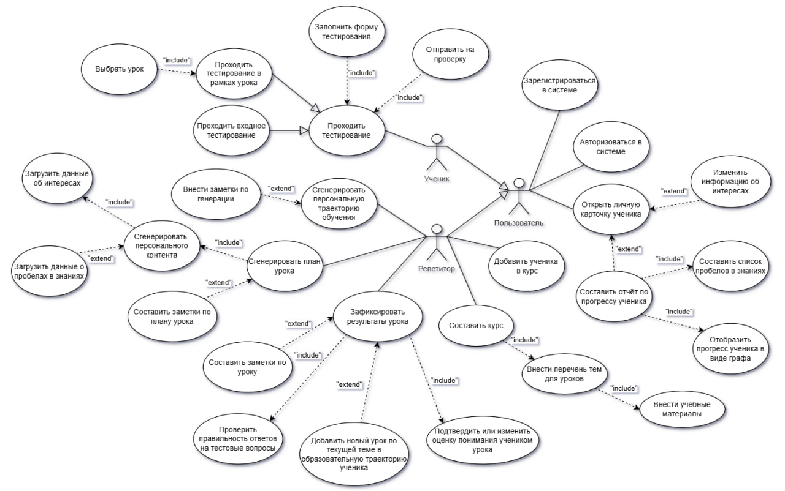 \
Рисунок 1 - Use Case Diagram

2. Activity Diagram #1: \
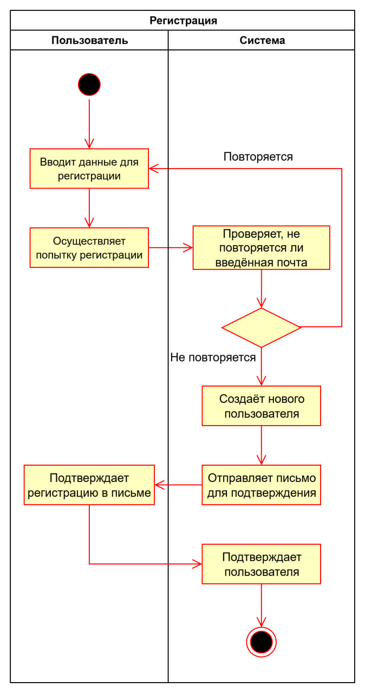 \
Рисунок 2 - Activity Diagram #1

3. Activity Diagram #2: \
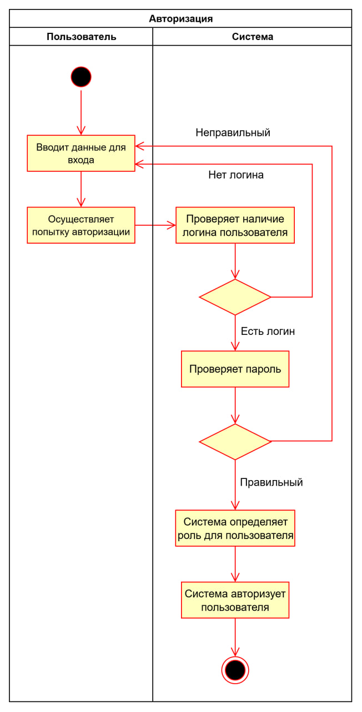 \
Рисунок 3 - Activity Diagram #2

4. Activity Diagram #3: \
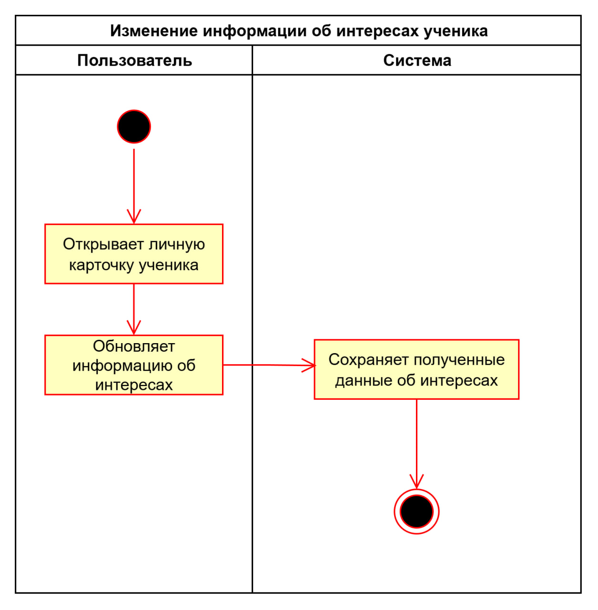 \
Рисунок 3 - Activity Diagram #3

5. Activity Diagram #4: \
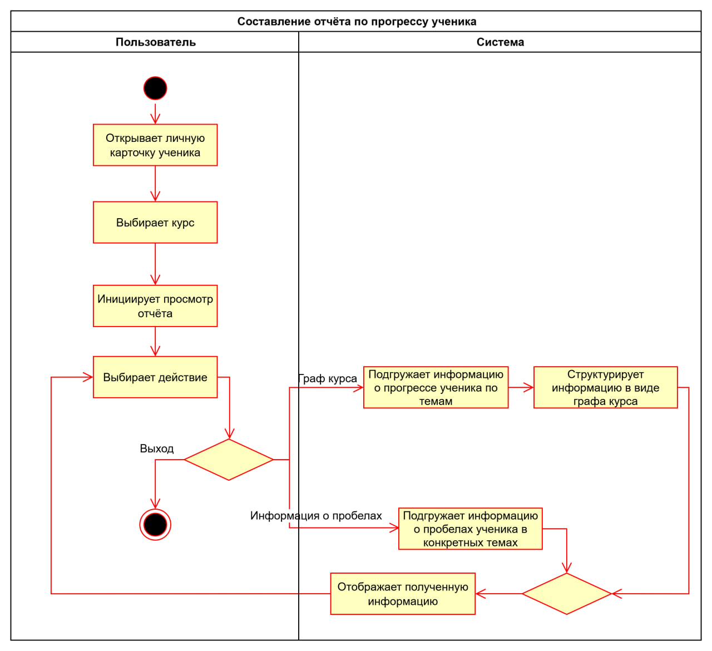 \
Рисунок 4 - Activity Diagram #4

6. Activity Diagram #5: \
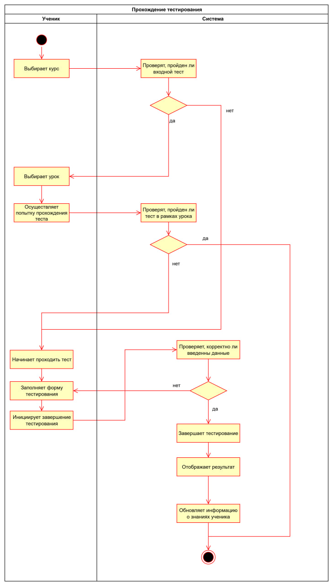 \
Рисунок 5 - Activity Diagram #5

7. Activity Diagram #6: \
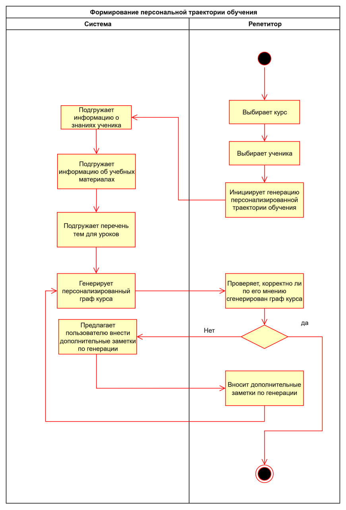 \
Рисунок 6 - Activity Diagram #6

8. Activity Diagram #7: \
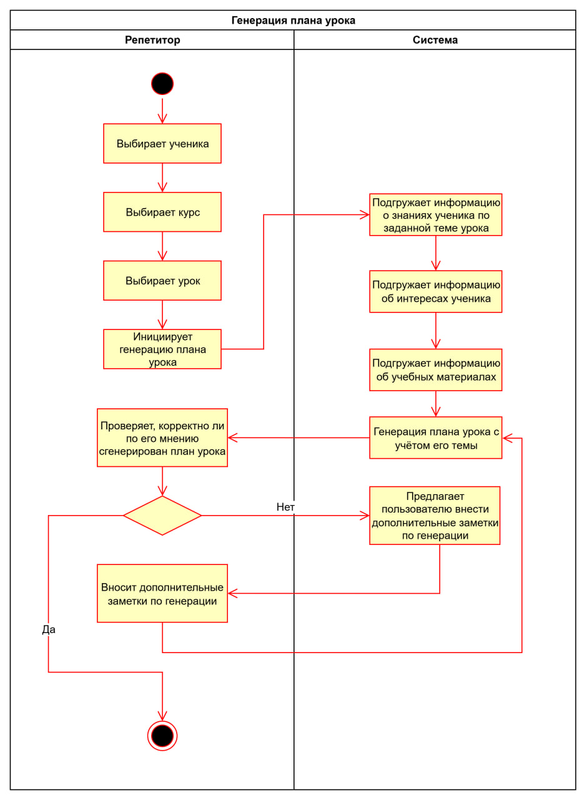 \
Рисунок 7 - Activity Diagram #7

9. Activity Diagram #8: \
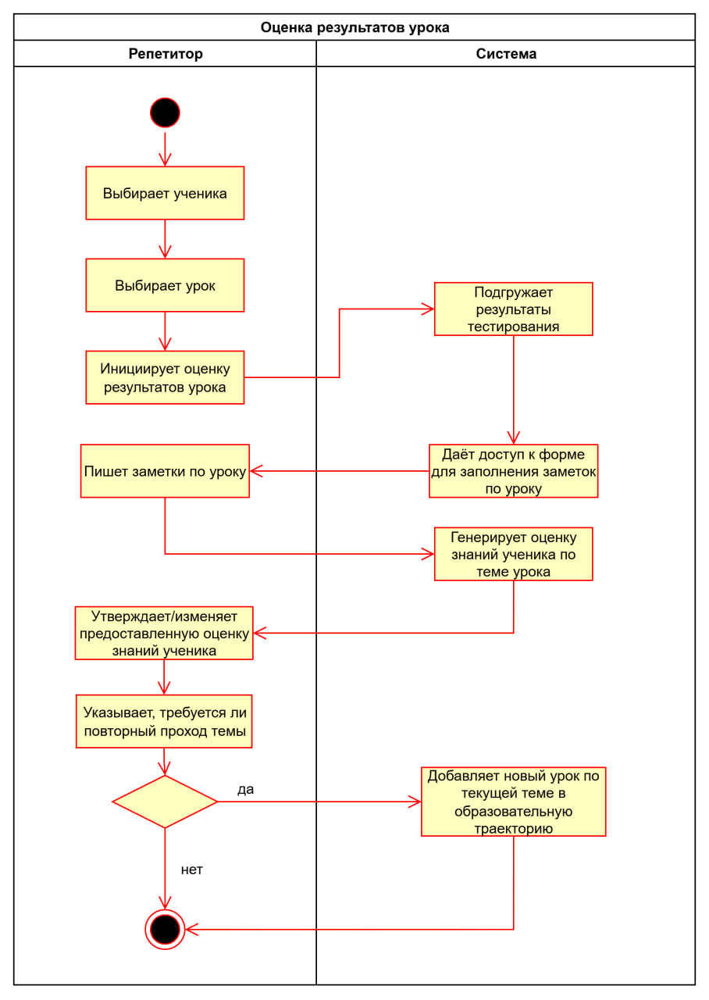 \
Рисунок 8 - Activity Diagram #8

10. Activity Diagram #9: \
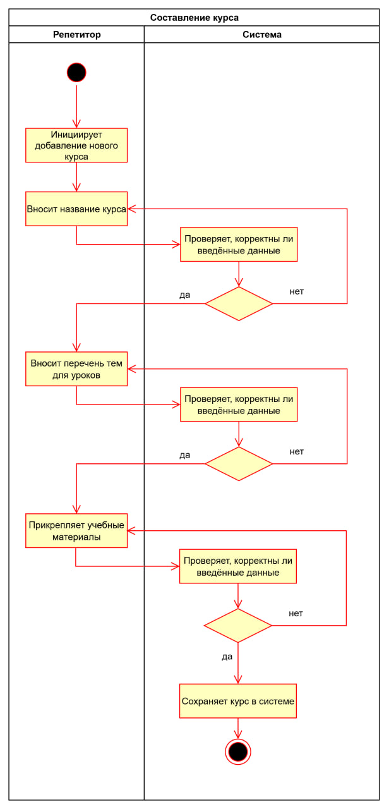 \
Рисунок 9 - Activity Diagram #9

11. Activity Diagram #10: \
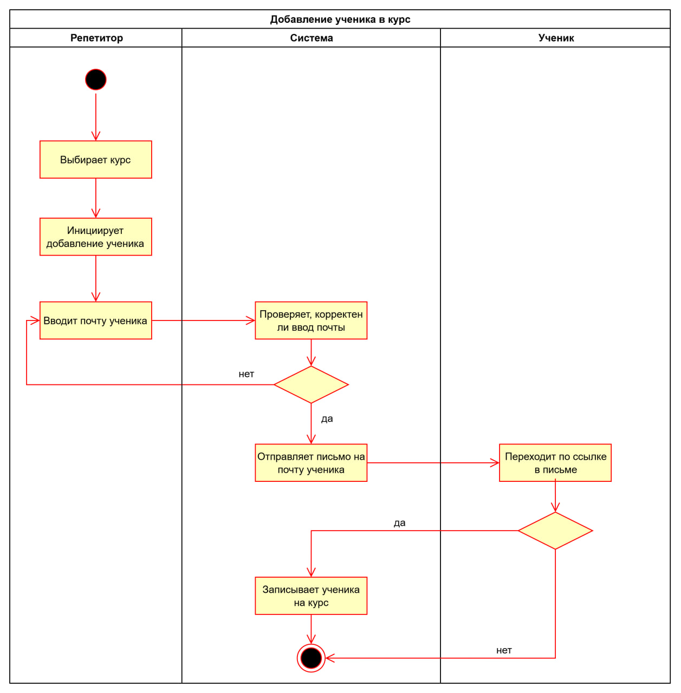 \
Рисунок 10 - Activity Diagram #10
